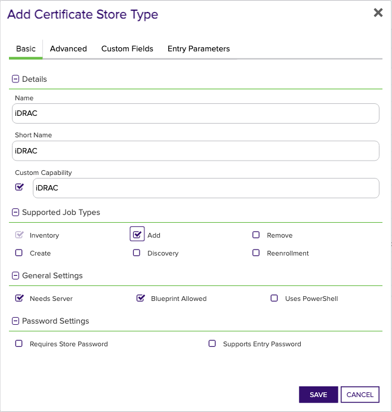
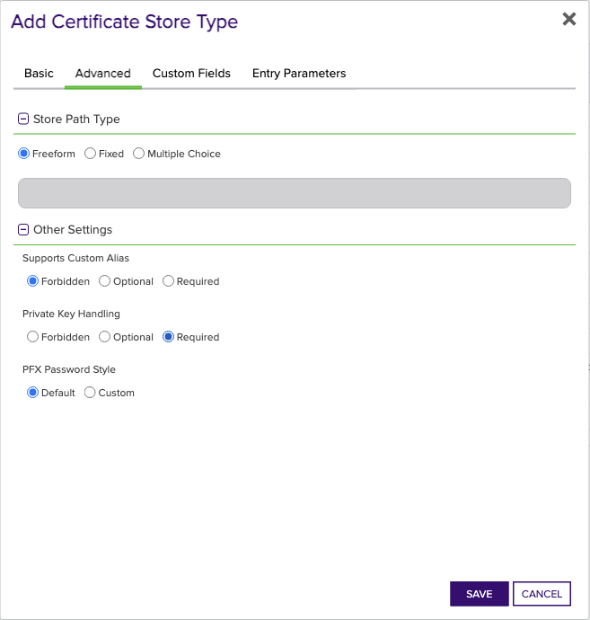

<h1 align="center" style="border-bottom: none">
    Dell iDRAC Universal Orchestrator Extension
</h1>

<p align="center">
  <!-- Badges -->

<a href="https://github.com/Keyfactor/dell-idrac-orchestrator/releases"></a>


</p>

<p align="center">
  <!-- TOC -->
  <a href="#support">
    <b>Support</b>
  </a>
  ·
  <a href="#installation">
    <b>Installation</b>
  </a>
  ·
  <a href="#license">
    <b>License</b>
  </a>
  ·
  <a href="https://github.com/orgs/Keyfactor/repositories?q=orchestrator">
    <b>Related Integrations</b>
  </a>
</p>

## Overview

The Integrated Dell Remote Access Controller (iDRAC) Orchestrator Extension supports the following use cases:

- Inventorying the iDRAC instance's server certificate and importing it into Keyfactor Command for management
- Adding or Replacing an existing or newly enrolled certificate and private key to an existing iDRAC instance.  To replace an existing server certificate, the Ovewrite flag in Keyfactor Command must be selected.

Use cases NOT supported by the iDRAC Orchestrator Extension:

- Removing a server certificate from an iDRAC instance.
- Inventorying or Managing any other certificate type on an iDRAC intance.

Special Notes:
* When adding or replacing the server certificate, there will be a few minute delay as the iDRAC instance will restart.  As a result, it may take a few minutes before the new certificate is reflected in subsequent Inventory jobs.
* When replacing an existing server certificate, the Overwrite checkbox must be selected/checked.  When this checkbox is selected, Keyfactor Command may require you to enter an alias.  This alias is not used by the orchestrator extension, so just enter any value.


## Compatibility

This integration is compatible with Keyfactor Universal Orchestrator version 10.4 and later.

## Support
The Dell iDRAC Universal Orchestrator extension If you have a support issue, please open a support ticket by either contacting your Keyfactor representative or via the Keyfactor Support Portal at https://support.keyfactor.com. 
 
> To report a problem or suggest a new feature, use the **[Issues](../../issues)** tab. If you want to contribute actual bug fixes or proposed enhancements, use the **[Pull requests](../../pulls)** tab.

## Requirements & Prerequisites

Before installing the Dell iDRAC Universal Orchestrator extension, we recommend that you install [kfutil](https://github.com/Keyfactor/kfutil). Kfutil is a command-line tool that simplifies the process of creating store types, installing extensions, and instantiating certificate stores in Keyfactor Command.


1. The Orchestrator must run on a Windows Server machine with the [Racadm CLI utility](https://www.dell.com/support/home/en-us/drivers/driversdetails?driverid=8gmf6) installed, configured to reach the target iDRAC instance.  The Orchestrator must have read and write access to the folder where racadm.exe is installed.
2. A user id must be set up in iDRAC with minimum privileges of "Configure".  This will be used by the Racadm utility to manage the store.


## Create the iDRAC Certificate Store Type

To use the Dell iDRAC Universal Orchestrator extension, you **must** create the iDRAC Certificate Store Type. This only needs to happen _once_ per Keyfactor Command instance.


* **Create iDRAC using kfutil**:

    ```shell
    # iDRAC
    kfutil store-types create iDRAC
    ```

* **Create iDRAC manually in the Command UI**:
    <details><summary>Create iDRAC manually in the Command UI</summary>

    Create a store type called `iDRAC` with the attributes in the tables below:

    #### Basic Tab
    | Attribute | Value | Description |
    | --------- | ----- | ----- |
    | Name | iDRAC | Display name for the store type (may be customized) |
    | Short Name | iDRAC | Short display name for the store type |
    | Capability | iDRAC | Store type name orchestrator will register with. Check the box to allow entry of value |
    | Supports Add | ✅ Checked | Check the box. Indicates that the Store Type supports Management Add |
    | Supports Remove | 🔲 Unchecked |  Indicates that the Store Type supports Management Remove |
    | Supports Discovery | 🔲 Unchecked |  Indicates that the Store Type supports Discovery |
    | Supports Reenrollment | 🔲 Unchecked |  Indicates that the Store Type supports Reenrollment |
    | Supports Create | 🔲 Unchecked |  Indicates that the Store Type supports store creation |
    | Needs Server | ✅ Checked | Determines if a target server name is required when creating store |
    | Blueprint Allowed | ✅ Checked | Determines if store type may be included in an Orchestrator blueprint |
    | Uses PowerShell | 🔲 Unchecked | Determines if underlying implementation is PowerShell |
    | Requires Store Password | 🔲 Unchecked | Enables users to optionally specify a store password when defining a Certificate Store. |
    | Supports Entry Password | 🔲 Unchecked | Determines if an individual entry within a store can have a password. |

    The Basic tab should look like this:

    

    #### Advanced Tab
    | Attribute | Value | Description |
    | --------- | ----- | ----- |
    | Supports Custom Alias | Forbidden | Determines if an individual entry within a store can have a custom Alias. |
    | Private Key Handling | Required | This determines if Keyfactor can send the private key associated with a certificate to the store. Required because IIS certificates without private keys would be invalid. |
    | PFX Password Style | Default | 'Default' - PFX password is randomly generated, 'Custom' - PFX password may be specified when the enrollment job is created (Requires the Allow Custom Password application setting to be enabled.) |

    The Advanced tab should look like this:

    

    #### Custom Fields Tab
    Custom fields operate at the certificate store level and are used to control how the orchestrator connects to the remote target server containing the certificate store to be managed. The following custom fields should be added to the store type:

    | Name | Display Name | Description | Type | Default Value/Options | Required |
    | ---- | ------------ | ---- | --------------------- | -------- | ----------- |
    | ServerUsername | Server Username | The user ID (or, if using a PAM provider, the key pointing to the user ID) to log into the iDRAC instance being managed. | Secret |  | ✅ Checked |
    | ServerPassword | Server Password | The password (or, if using a PAM provider, the key pointing to the password) for the user ID above. | Secret |  | ✅ Checked |

    The Custom Fields tab should look like this:

    


    </details>

## Installation

1. **Download the latest Dell iDRAC Universal Orchestrator extension from GitHub.** 

    Navigate to the [Dell iDRAC Universal Orchestrator extension GitHub version page](https://github.com/Keyfactor/dell-idrac-orchestrator/releases/latest). Refer to the compatibility matrix below to determine whether the `net6.0` or `net8.0` asset should be downloaded. Then, click the corresponding asset to download the zip archive.
    | Universal Orchestrator Version | Latest .NET version installed on the Universal Orchestrator server | `rollForward` condition in `Orchestrator.runtimeconfig.json` | `dell-idrac-orchestrator` .NET version to download |
    | --------- | ----------- | ----------- | ----------- |
    | Older than `11.0.0` | | | `net6.0` |
    | Between `11.0.0` and `11.5.1` (inclusive) | `net6.0` | | `net6.0` | 
    | Between `11.0.0` and `11.5.1` (inclusive) | `net8.0` | `Disable` | `net6.0` | 
    | Between `11.0.0` and `11.5.1` (inclusive) | `net8.0` | `LatestMajor` | `net8.0` | 
    | `11.6` _and_ newer | `net8.0` | | `net8.0` |

    Unzip the archive containing extension assemblies to a known location.

    > **Note** If you don't see an asset with a corresponding .NET version, you should always assume that it was compiled for `net6.0`.

2. **Locate the Universal Orchestrator extensions directory.**

    * **Default on Windows** - `C:\Program Files\Keyfactor\Keyfactor Orchestrator\extensions`
    * **Default on Linux** - `/opt/keyfactor/orchestrator/extensions`
    
3. **Create a new directory for the Dell iDRAC Universal Orchestrator extension inside the extensions directory.**
        
    Create a new directory called `dell-idrac-orchestrator`.
    > The directory name does not need to match any names used elsewhere; it just has to be unique within the extensions directory.

4. **Copy the contents of the downloaded and unzipped assemblies from __step 2__ to the `dell-idrac-orchestrator` directory.**

5. **Restart the Universal Orchestrator service.**

    Refer to [Starting/Restarting the Universal Orchestrator service](https://software.keyfactor.com/Core-OnPrem/Current/Content/InstallingAgents/NetCoreOrchestrator/StarttheService.htm).


6. **(optional) PAM Integration** 

    The Dell iDRAC Universal Orchestrator extension is compatible with all supported Keyfactor PAM extensions to resolve PAM-eligible secrets. PAM extensions running on Universal Orchestrators enable secure retrieval of secrets from a connected PAM provider.

    To configure a PAM provider, [reference the Keyfactor Integration Catalog](https://keyfactor.github.io/integrations-catalog/content/pam) to select an extension, and follow the associated instructions to install it on the Universal Orchestrator (remote).


> The above installation steps can be supplimented by the [official Command documentation](https://software.keyfactor.com/Core-OnPrem/Current/Content/InstallingAgents/NetCoreOrchestrator/CustomExtensions.htm?Highlight=extensions).


## Defining Certificate Stores


* **Manually with the Command UI**

    <details><summary>Create Certificate Stores manually in the UI</summary>

    1. **Navigate to the _Certificate Stores_ page in Keyfactor Command.**

        Log into Keyfactor Command, toggle the _Locations_ dropdown, and click _Certificate Stores_.

    2. **Add a Certificate Store.**

        Click the Add button to add a new Certificate Store. Use the table below to populate the **Attributes** in the **Add** form.
        | Attribute | Description |
        | --------- | ----------- |
        | Category | Select "iDRAC" or the customized certificate store name from the previous step. |
        | Container | Optional container to associate certificate store with. |
        | Client Machine | The IP address of the iDRAC instance being managed. |
        | Store Path | Enter the full path where the Racadm executable is installed on the orchestrator server.  See [Requirements & Prerequisites](#requirements--prerequisites) above for more details. |
        | Orchestrator | Select an approved orchestrator capable of managing `iDRAC` certificates. Specifically, one with the `iDRAC` capability. |
        | ServerUsername | The user ID (or, if using a PAM provider, the key pointing to the user ID) to log into the iDRAC instance being managed. |
        | ServerPassword | The password (or, if using a PAM provider, the key pointing to the password) for the user ID above. |


        

        <details><summary>Attributes eligible for retrieval by a PAM Provider on the Universal Orchestrator</summary>

        If a PAM provider was installed _on the Universal Orchestrator_ in the [Installation](#Installation) section, the following parameters can be configured for retrieval _on the Universal Orchestrator_.
        | Attribute | Description |
        | --------- | ----------- |
        | ServerUsername | The user ID (or, if using a PAM provider, the key pointing to the user ID) to log into the iDRAC instance being managed. |
        | ServerPassword | The password (or, if using a PAM provider, the key pointing to the password) for the user ID above. |


        Please refer to the **Universal Orchestrator (remote)** usage section ([PAM providers on the Keyfactor Integration Catalog](https://keyfactor.github.io/integrations-catalog/content/pam)) for your selected PAM provider for instructions on how to load attributes orchestrator-side.

        > Any secret can be rendered by a PAM provider _installed on the Keyfactor Command server_. The above parameters are specific to attributes that can be fetched by an installed PAM provider running on the Universal Orchestrator server itself. 
        </details>
        

    </details>

* **Using kfutil**
    
    <details><summary>Create Certificate Stores with kfutil</summary>
    
    1. **Generate a CSV template for the iDRAC certificate store**

        ```shell
        kfutil stores import generate-template --store-type-name iDRAC --outpath iDRAC.csv
        ```
    2. **Populate the generated CSV file**

        Open the CSV file, and reference the table below to populate parameters for each **Attribute**.
        | Attribute | Description |
        | --------- | ----------- |
        | Category | Select "iDRAC" or the customized certificate store name from the previous step. |
        | Container | Optional container to associate certificate store with. |
        | Client Machine | The IP address of the iDRAC instance being managed. |
        | Store Path | Enter the full path where the Racadm executable is installed on the orchestrator server.  See [Requirements & Prerequisites](#requirements--prerequisites) above for more details. |
        | Orchestrator | Select an approved orchestrator capable of managing `iDRAC` certificates. Specifically, one with the `iDRAC` capability. |
        | ServerUsername | The user ID (or, if using a PAM provider, the key pointing to the user ID) to log into the iDRAC instance being managed. |
        | ServerPassword | The password (or, if using a PAM provider, the key pointing to the password) for the user ID above. |


        

        <details><summary>Attributes eligible for retrieval by a PAM Provider on the Universal Orchestrator</summary>

        If a PAM provider was installed _on the Universal Orchestrator_ in the [Installation](#Installation) section, the following parameters can be configured for retrieval _on the Universal Orchestrator_.
        | Attribute | Description |
        | --------- | ----------- |
        | ServerUsername | The user ID (or, if using a PAM provider, the key pointing to the user ID) to log into the iDRAC instance being managed. |
        | ServerPassword | The password (or, if using a PAM provider, the key pointing to the password) for the user ID above. |


        > Any secret can be rendered by a PAM provider _installed on the Keyfactor Command server_. The above parameters are specific to attributes that can be fetched by an installed PAM provider running on the Universal Orchestrator server itself. 
        </details>
        

    3. **Import the CSV file to create the certificate stores** 

        ```shell
        kfutil stores import csv --store-type-name iDRAC --file iDRAC.csv
        ```
    </details>

> The content in this section can be supplimented by the [official Command documentation](https://software.keyfactor.com/Core-OnPrem/Current/Content/ReferenceGuide/Certificate%20Stores.htm?Highlight=certificate%20store).


## License

Apache License 2.0, see [LICENSE](LICENSE).

## Related Integrations

See all [Keyfactor Universal Orchestrator extensions](https://github.com/orgs/Keyfactor/repositories?q=orchestrator).